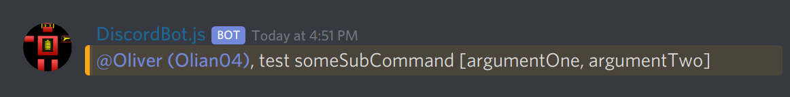

# discord-commander

A command manager for discord.js bots.

```ts
import { Client } from 'discord.js';
import { Command, Commander, Event, parse, subscribe } from 'discord-commander';

class TestCommand extends Command('test') {
  @parse.nextWord private subCommand: string;
  @parse.remainingWords private arguments: string[];

  @subscribe('new')
  public onMessage(ctx: Event) {
    ctx.message.reply(`${ctx.command} ${this.subCommand} [${this.arguments.join(', ')}]`);
  }
}

const commander = new Commander('!', [
  TestCommand,
]);

const client = new Client();

// Either let commander setup its own simple event listeners
commander.simpleSetup(client);

// or delegate messages to commander manually
const isInvalid = (message) => message.author.bot || !commander.isKnownCommand(message);
const logCommand = (message) => {
  const [commandName, argumentString] = commander.parseCommand(message);
  console.log(`Command(name="${commandName}", args="${argumentString}")`);
}
client.on('message', (message) => {
  if (isInvalid(message)) { return; }
  logCommand(message);
  commander.handleMessage('new', message);
});
client.on('messageUpdate', (message) => {
  if (isInvalid(message)) { return; }
  logCommand(message);
  commander.handleMessage('edit', message);
});

client.login(discord_secret);
```

```txt
!test someSubCommand argumentOne argumentTwo
```



## Install

1. Install library: [`npm i discord-commander`](https://www.npmjs.com/package/discord-commander).
2. Enable `experimentalDecorators` and `emitDecoratorMetadata` in `tsconfig.json`.
3. Try the example above.

_Note: If you are using vscode you might need to set `javascript.implicitProjectConfig.experimentalDecorators` to `true` in the workspace settings._

## Development

1. Grab your discord-bot secret from the [discord developer portal](https://discordapp.com/developers/applications).
2. Create a `secrets.json` file and store your discord-bot secret as `discord_token` inside it.
3. Install dependencies: `npm i`.
4. Start demo: `npm run demo:start`.
